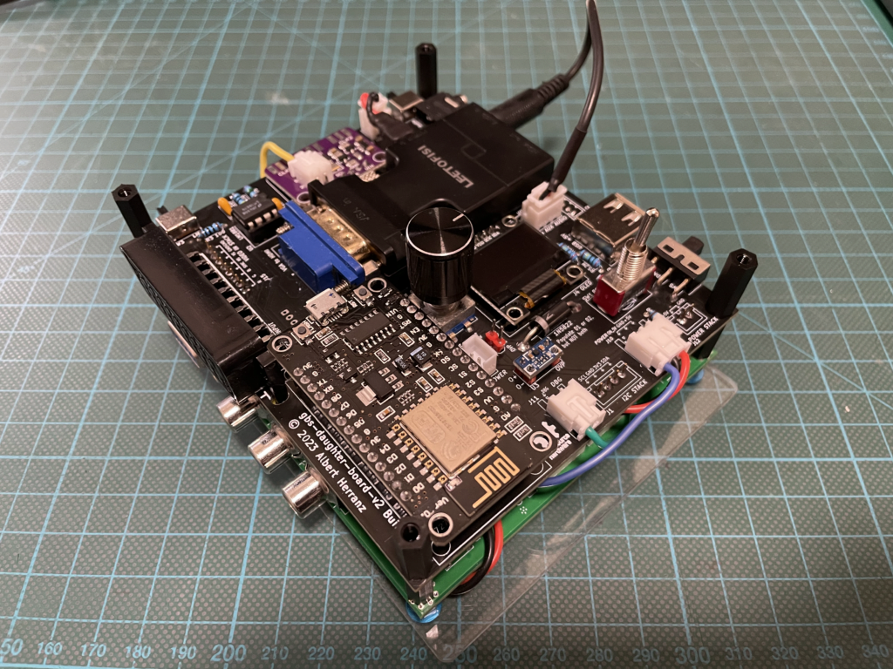

# GBS Control Daughter Board v2

Enhance your [GBS8200](https://ramapcsx2.github.io/gbs-control/Wiki/Build-the-Hardware.html) upscaler board.

> [!WARNING]
> This is a work in progress project.
>
> An adapter based on PCB v2 Build1 has been successfully built
>
> No build instructions are yet provided
>

## Introduction

The GBS Daughter Board v2 is a companion board for the GBS8200 upscaler.
It facilitates the upgrade of an off-the-shelf GBS8200 board to a gbs-control firmware based solution, with the following main features:

* HAT-like design, simply stack the daughter board on top of the existing GBS8200
* add SCART RGB input
* add switchable HDMI output (via embedded VGA to HDMI dongle)
* add switchable sync stripper based on the LM1881
* add 3.5" jack sound output
* add switchable common or separate audio ground
* add auxiliar USB socket to optionally power external dongle
* add small OLED screen and rotary encoder for local control

## References

gbs-control
* https://github.com/ramapcsx2/gbs-control

GBS-C AIO
* https://github.com/amoore2600/GBS-C_AIO

